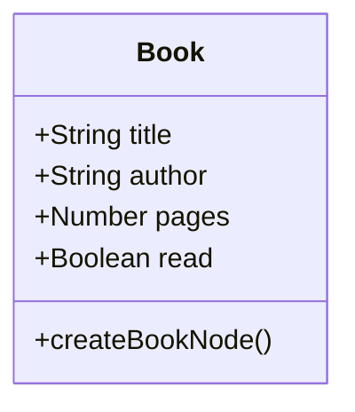

# odin-library
A small library app with JavaScript objects and object constructors

## Development

## What does the app do

The app manages the books stored in the library. 

Features:
- add a book to the library 
- remove a book from the library
- change the read status of a book

## live
