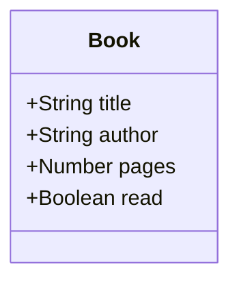

# odin-library
A small library app with JavaScript objects and object constructors

## development

## how does the app works

The app renders the book object that are stored in the library array on the webpage. It also allows you to add a book to the library by clicking a button and complete a form. It allows you to change the read status of a book.

## live
